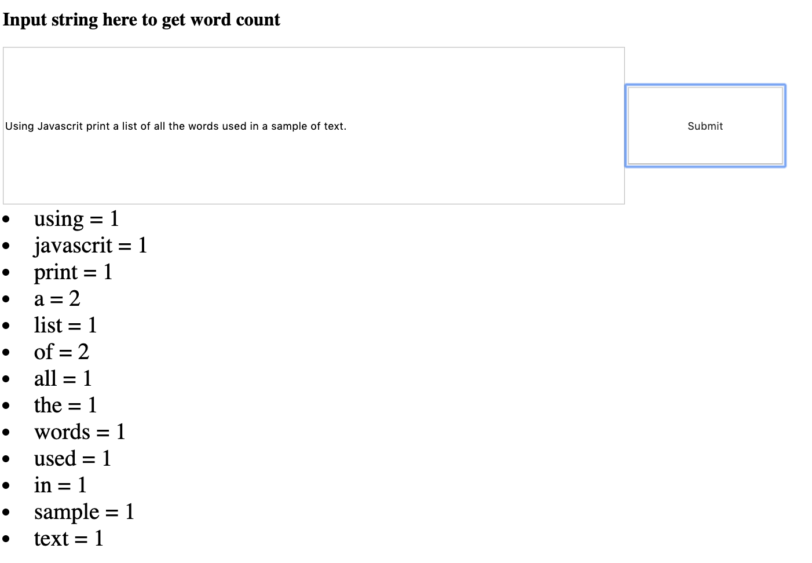

# Text Counter

## This is a javascript program that will return the number of words in a string. 

Start local environment to load html file.

Input a string into text field.

Click the submit button and list of word with count should appear.

